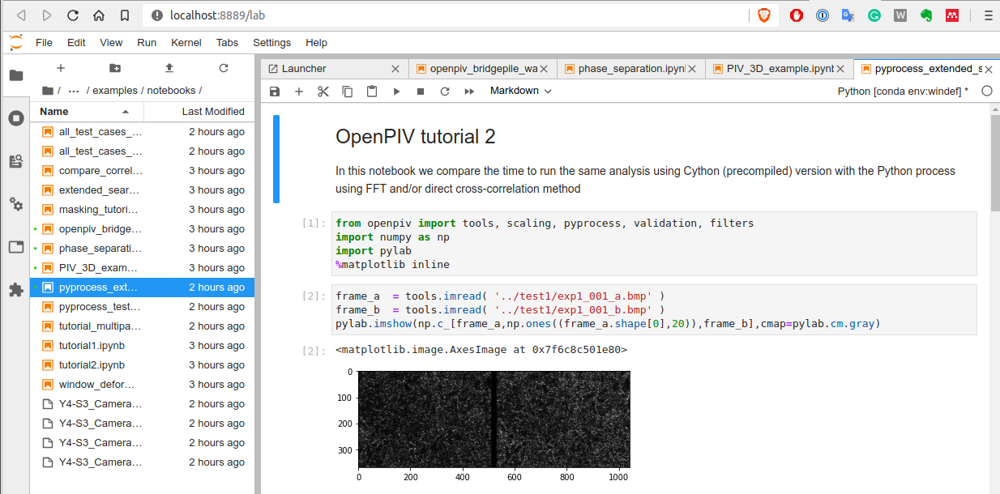
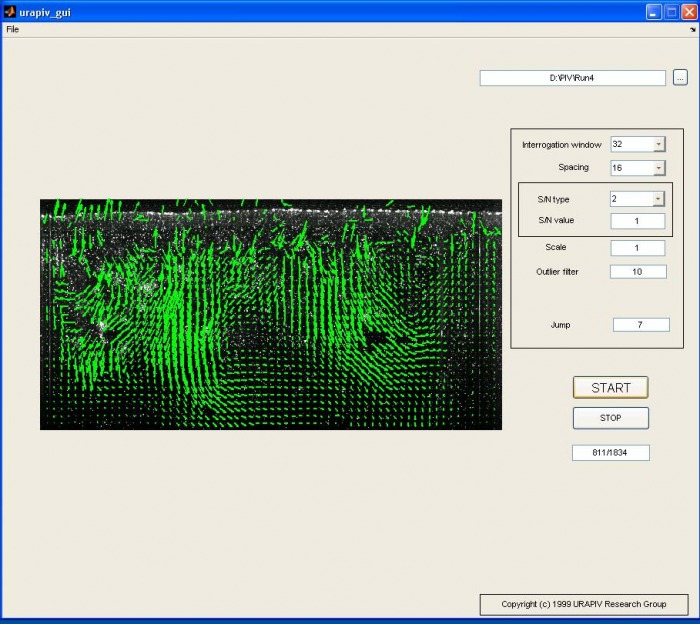
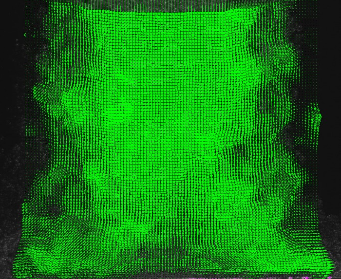
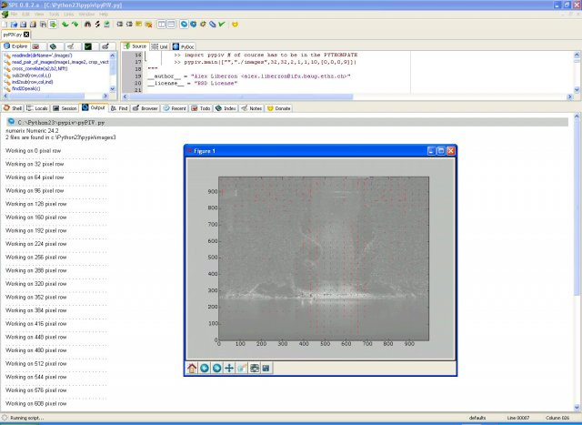
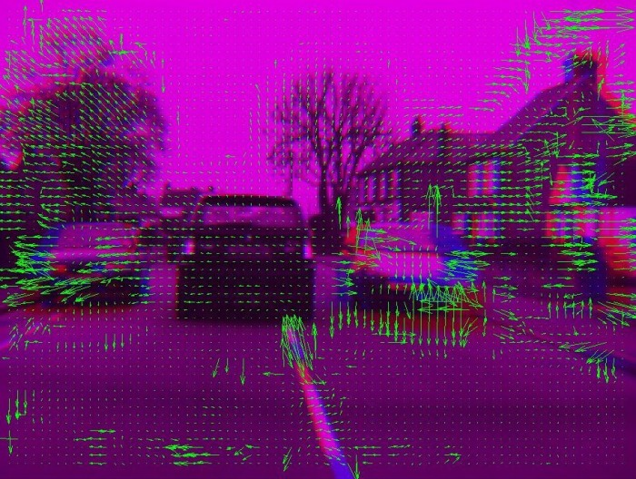

## Python version

Jupyter notebook

----

#### Matlab version with GUI 

----

#### Previous Matlab version with GUI - PIV of small scale vortices near a solid wall

----

#### Older GUI format for Matlab 6

---	

#### Matlab version with GUI - turbulent flow under an oscillating grid		

---

#### Impinging jet, see our work on pressure estimate using PIV

---

#### Python version, command line, see our online version on Wakari

----

#### Unusual PIV analysis - optical flow algorithm applied to car velocity estimate

---

#### Python version using Cython (C compiled Python code), test case

---

#### Small vesicle motion

----

#### Old, very first translation of Matlab code to Python, IDLE shell

----

### C++ with Qt-based GUI 

very fast algorithm, used for the long-duration, time-resolved PIV analysis of the 
dynamic flutter in turbulent flows. Analysing 10,000 image pairs can become an issue 
when the PIV analysis takes 1 minute per image pair. 
